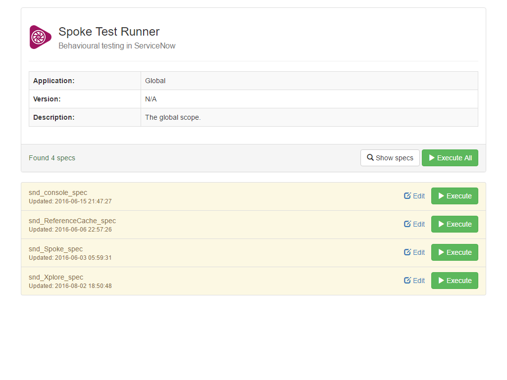
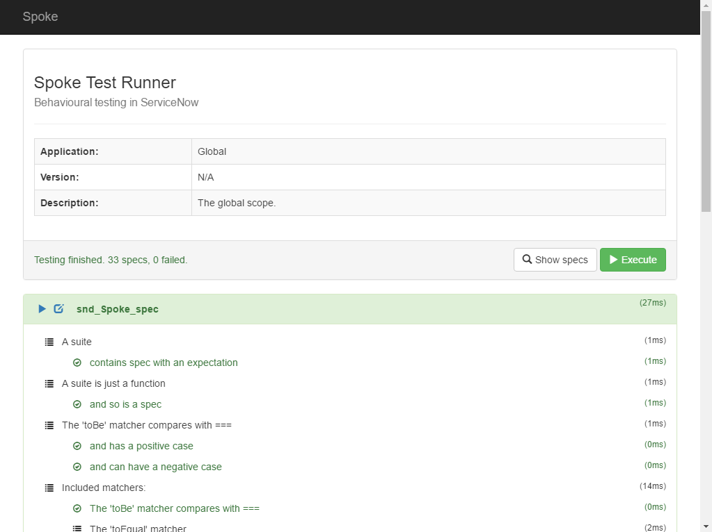

# Spoke

[**Get the Update Set.**](https://share.servicenow.com/app.do#/search-result?search_query=sndeveloper&startRow=NaN&sort_parameter=title)

*Spoke* is an application for ServiceNow that lets you run JavaScript specifications for behavior-driven development (BDD).

### Friendly Interface
*Spoke* has an interactive, user friendly interface which means running tests in ServiceNow is really easy. Literally, anyone can use it. Validate releases simply by going into Spoke and clicking one button. You really can forget about using fix scripts for testing!

### Living Documentation
When you start writing BDD tests, you are automatically building an API documentation for your code. As long as you keep your tests up to date, you've got living documentation and proof that your code does what it's supposed to do all in one. What's not to like?

### *Jasmine* Based
If you've ever used the popular *Jasmine* framework, then you're ready to go. *Spoke* uses a version of *Jasmine* that has been rebuilt from the ground up to work natively in ServiceNow.

### Scoped Support
*Spoke* can run tests in scoped applications as long as the scripts are globally accessible.

### Automation Support
Get the full test output as JSON for one or all the tests using a simple HTTP request.

### Self Tested
*Spoke* comes packaged with core *Jasmine* tests&dagger; so you can see for yourself what it can do.

&dagger;: Does not include tests for as yet unsupported functionality such as spies.

## Usage Instructions

### General

Install it, and then…

1. Create a script include with *\_spec* appended to the name&dagger;. This is how *Spoke* will find your test specifications.
2. Create a new suite and write about what your code does and the expectations you have. This is the hardest bit to learn how to do well if you're new to BDD.

  <pre>
    describe('MyClass', function () {

      it('does some cool stuff', function () {

        expect('cool stuff').not.toBe('uncool stuff');

      });

    });
  </pre>

3. Execute the specification in Spoke.

&dagger; If you are writing a specification for a script include, simply use the same name plus '\_spec'. You don't have to do this, but it will make your life easier. E.g. 'MyClass' -> 'MyClass\_spec'

### Scoped Applications

1. Append ?sys\_scope=_your scope name_ to the URL. *Spoke* will then scan for Script Includes belonging to that application scope that in *\_spec*.
2. Test away!

### Automation

1. From the *Spoke* interface, locate the spec you want to test.
2. Right click on the _Execute_ button and open it in a new window.
3. You'll see JSON output for your test that you can plug into a tool by copying the URL.

## Supported Functionality

Not everything that you can do with *Jasmine* can be done with *Spoke*, mainly due to the limitations of running on a server architecture instead of a browser. Other stuff has just been skipped for the time being.

* Suite definition
  * describe
  * xdescribe
* Specification definition
  * it
  * xit
  * beforeAll
  * beforeEach
  * afterAll
  * afterEach
  * expect
* Expectation Matchers
  * toBe
  * toEqual
  * toMatch
  * toBeDefined
  * toBeUndefined
  * toBeNull
  * toBeTruthy
  * toBeFalsy
  * toContain
  * toBeLessThan
  * toBeGreaterThan
  * toBeCloseTo
  * toThrow
  * toThrowError
  * not.*
* Other
  * fail

## Credits

* Jasmine: [jasmine / jasmine](https://github.com/jasmine/jasmine)

## License

[MIT Licence](https://github.com/sn-developer/spoke/blob/master/LICENSE.md)
